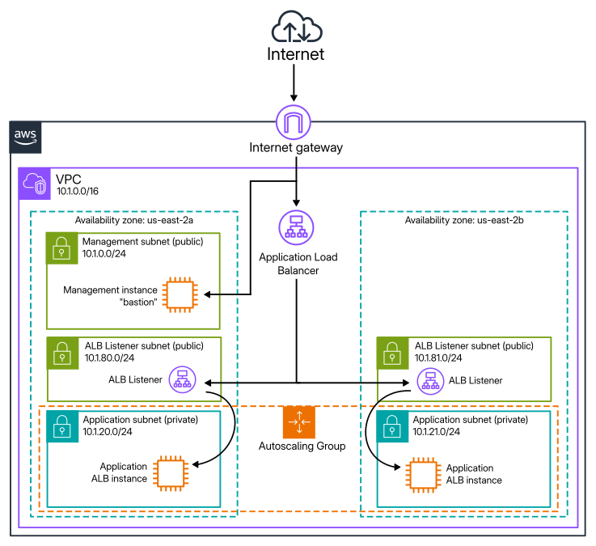

# Coalfire SRE AWS Technical Challenge

## The Site

The diagram below represents the site as initially planned. Unfortunately, the Terraform code doesn't currently apply, so the diagrammed ALB is not currently deployable.

## Discussion

First, I looked at Coalfire's AWS Terraform modules, I started writing code with these but quickly realized I wouldn't be able to understand them enough to fully implement in the time available for the challenge.

The top Google search result for AWS Terraform modules is [Terraform AWS Modules](https://registry.terraform.io/namespaces/terraform-aws-modules), this seemed to be a strong endorsement. These modules have reasonably comprehensible example code and looked like they'd work for my implementation plan: there are modules for handling VPC, Security Groups, EC2 Instances, ASG, and ALB.

I started by deploying the VPC and network configuraton. This was straightforward. The security group for the management subnet was next, then the management EC2 instance. After these were deployed I successfully tested connecting to the bastion instance via SSH.

Encouraged by this, I started working on the ASG. First by adding another security group for ssh to the ASG instances from the bastion instance, then  setting up the ASG itself and deploying a couple of instances into the application subnets. This was less straigthforward for me, and I fought with syntax, resource names, and module outputs. Once I had it deploying I was able to test hopping through the bastion into the ASG instances.

Next, I started working on the ALB. Unfortunately I ran into a roadblock with the [Terraform AWS Modules ALB module](https://registry.terraform.io/modules/terraform-aws-modules/alb/aws/latest). I was able to deploy an ALB but not attach it to the ASG. The ALB module example code doesn't document ASG targets. Given more time I'd work on implementing the ALB via Hashicorp's AWS provider resources directly, but getting this far has already exceeded my time budget for the project, given my inexperience with AWS and Terraform.

It seems like ASGs are not well supported by this module author, my next step was to install apache on the ASG instances, but I found the `user_data` input in the ASG module configuration doesn't seem run the provided bash script on the instances. Again, given more time I'd approach this by writing directly with Hashicorp's provider resources directly.

I've commented out the ALB code in the current main.tf. It was previously running but I wanted to leave the target group code in place for future experimentation.

## References

> terraform-aws-modules github - the modules i decided to try
https://github.com/terraform-aws-modules

> VPC module from above
https://github.com/terraform-aws-modules/terraform-aws-vpc

> security group module from above
https://github.com/terraform-aws-modules/terraform-aws-security-group

> ec2 module from above
https://github.com/terraform-aws-modules/terraform-aws-ec2-instance

> ASG module from above
https://registry.terraform.io/modules/terraform-aws-modules/autoscaling/aws/latest

> ASG examples from above
https://github.com/terraform-aws-modules/terraform-aws-autoscaling/tree/master/examples/complete

> AWS docs about VPC & subnetting
https://docs.aws.amazon.com/vpc/latest/userguide/vpc-example-private-subnets-nat.html

> ALB/NLB terraform module
https://registry.terraform.io/modules/terraform-aws-modules/alb/aws/latest

> ALB examples from above
https://github.com/terraform-aws-modules/terraform-aws-alb/blob/master/docs/patterns.md

> AWS docs about ALB subnets and routing 
https://docs.aws.amazon.com/prescriptive-guidance/latest/load-balancer-stickiness/subnets-routing.html

> AWS docs about ALB creation
https://docs.aws.amazon.com/elasticloadbalancing/latest/application/create-application-load-balancer.html

> AWS doc about ALB target help_associating_asg_with_alb_target_group_using
https://docs.aws.amazon.com/elasticloadbalancing/latest/application/load-balancer-target-groups.html

> reddit post about target group problems b/n ASG and ALB
https://www.reddit.com/r/Terraform/comments/1kkx9jb/help_associating_asg_with_alb_target_group_using/

> traffic source attachment example code referenced by above
https://github.com/terraform-aws-modules/terraform-aws-autoscaling/blob/d2975372e3c6530aade7797063c67dab9d0315d8/examples/complete/main.tf#L52

> more about traffic source attachments
https://registry.terraform.io/providers/hashicorp/aws/latest/docs/resources/autoscaling_traffic_source_attachment

> AWS doc about ELB attchment to ASG
https://docs.aws.amazon.com/autoscaling/ec2/userguide/getting-started-elastic-load-balancing.html

> AWS doc about instance user data
https://docs.aws.amazon.com/AWSEC2/latest/UserGuide/user-data.html

> AWS doc about setting up ASG and LB
https://docs.aws.amazon.com/autoscaling/ec2/userguide/tutorial-ec2-auto-scaling-load-balancer.html
