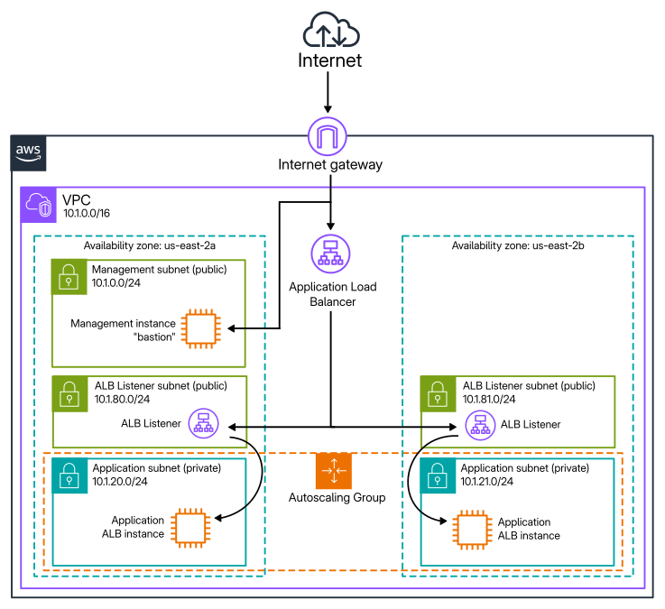

# Coalfire SRE AWS Technical Challenge

# Site Overview

The diagram below represents the site as initially planned. Unfortunately, the Terraform code doesn't currently fully apply, so **the diagrammed ALB is not currently deployable.**

The diagram presents a single VPC spanning 2 Availability Zones. Each AZ hosts public and private subnets. A public Management subnet for the bastion EC2 instance exists in only one AZ. Both AZs contain a public subnet for an ALB listener, and a private subnet for ASG instances. An Internet Gateway allows traffic to and from the Internet into the VPC. Traffic can pass from the IG to the bastion instance, and to the ALB. The ALB passes traffic to Listeners which pass traffic to the ASG instances in their private subnets. (Access via SSH from the bastion to the ASG instances is not pictured.)



# Deployment

## Prerequisites

- An AWS account 
- A workstation configured with Terraform & appropriate credentials to deploy to AWS

Consult the appropriate documentation from [Amazon](https://docs.aws.amazon.com/accounts/latest/reference/manage-acct-creating.html) and [Hashicorp](https://developer.hashicorp.com/terraform/tutorials/aws-get-started) (respectively) for setup instructions.

## Deployment instructions

1. Clone the code repository: [https://github.com/dberner/challenge-dberner](https://github.com/dberner/challenge-dberner)
```
git clone https://github.com/dberner/challenge-dberner
```
2. Navigate into the repository directory
```
cd challenge-dberner
```
3. Run Terraform to deploy the site
```
terraform init
terraform apply
```
4. When done, remove the deployed resources
```
terraform destroy
```


# Discussion

## Design

I planned to follow the specification as closely as possible and set up a bare bones site with 3 instances in 2 AZs, with appropriate visibility to the Internet and subnet allocations as described.

Once a basic site was deployed I'd planned to install a simple app and then provide whatever storage and backend was required for it. A minimum viable app would need a single S3 storage bucket and a simple database, perhaps on another instance or using an AWS service.

## Assumptions

1. A basic HTTP site
1. No logging, monitoring, or autoscaling
1. Terraform deploys all resources
1. Use a generic public AMI

## Improvement plan

In priority order. The custom AMI and dynamic autoscaling are nice-to-have and not strictly necessary.

### 1. Finish the basic site
The first step in improvement would be to get the site working as planned. Finish the ALB deployment and configuration, get Apache installed and running on the Application instances.

### 2. Install the app and supporting AWS resources
Next, complete the initial plan by installing a simple app and the backend resources required for its function.

### 3. Logging, monitoring, and alerting
Set up Cloudwatch logging, metrics, and alerting or deploy Nagios or similar tools to DIY it. DYI might be cheaper, but will be more development and ongoing effort.

### 4. DNS, and SSL/TLS
Set up a DNS name for the site. Once the site has a name, we can create SSL/TLS certificates and enable HTTPS on the ALB. This is a security priority and a basic expectation of the modern web.

### 5. Operational improvements
See the [Operational gaps](#operational-gaps) section below.

### 6. A custom AMI for the app servers
Simplify app deployment by generating a custom AMI with the application and configuration pre-installed.

### 7. Dynamic Autoscaling
The ASG is not set up to respond to traffic needs at this point. Set up dynamic autoscaling.

## General notes

Approaching this challenge, my first task was to get a development environment set up for the project. I created a distrobox to provide a clean workspace on my system, installed basic tools into it, created an AWS account, installed the AWS CLI, set up my AWS credentials, installed Terraform, created a ssh key for pushing to github, and made sure everything was working correctly. All subsequent work was done in the distrobox environment.

To begin the actual work, I looked at Coalfire's AWS Terraform modules. I started writing code with these, but eventually realized I wouldn't be able to understand them well enough to fully implement the project in the time available for the challenge. (This code is available in the [coalfire-terraform-attempt](./coalfire-terraform-attempt/) subdirectory.)

The top Google search result for AWS Terraform modules is [Terraform AWS Modules](https://registry.terraform.io/namespaces/terraform-aws-modules), this seemed to me a reasonably strong endorsement. These modules have comprehensible example code and looked like they would work for my initial implementation plan - there are modules for handling VPC, Security Groups, EC2 Instances, ASG, and ALB.

I started by deploying the VPC and network configuraton. This was straightforward. The security group for the management subnet was next, then the management EC2 instance. After these were deployed I successfully tested connecting to the bastion instance via SSH.

Encouraged by this, I started working on the ASG. First by adding another security group, for ssh to the ASG instances from the bastion instance, then setting up the ASG itself and deploying a couple of instances into the application subnets. This was less straigthforward for me, I haven't worked with ASG on AWS before, and had to read up on concepts, and I fought with Terraform syntax, resource names, and module outputs. Once I had it deploying I was able to test hopping through the bastion into the ASG instances.

Next, I started working on the ALB. Unfortunately I ran into a roadblock with the [Terraform AWS Modules ALB module](https://registry.terraform.io/modules/terraform-aws-modules/alb/aws/latest). I was able to deploy an ALB but not attach it to the ASG. The ALB module doesn't document ASG targets. I tried passing the exported ARN and IDs from the ASG module to the ALB, and found a [Reddit thread](https://www.reddit.com/r/Terraform/comments/1kkx9jb/help_associating_asg_with_alb_target_group_using/) discussing this problem with these modules, which suggested a change to the ASG was needed as well, but I wasn't able to get a working deployment. At this point I'd run out of time.

Given more time I'd work on implementing the ALB via Hashicorp's AWS provider resources directly, but getting this far has already exceeded my time budget for the project, given my inexperience with AWS and Terraform.

It seems like ASGs are not well supported by this module author, as my next step was to install apache on the ASG instances. I'd thought this would be a simple matter of passing a bash script to the instances, but I found the `user_data` input in the ASG module configuration doesn't seem run the provided bash script on the instances. Again, given more time I'd approach this by writing with Hashicorp's provider resources rather than the abstractions provided by the chosen modules.

> [!NOTE]
> I've commented out the ALB code in the current main.tf. It was deploying before I made changes to the target group inputs but I wanted to leave the target group code in place for future experimentation.

## Operational Gaps

1. SSH access to bastion and app servers
  - There is only one shared account and ssh key to log into the bastion
    - Set up a system to handle multiple users and keys, perhaps leveraging AWS Secrets Manager
  - Connecting to the app servers requires a manual hop through the bastion
    - Deploy users and ssh keys to the bastion allowing ProxyJump configuration to directly access nodes via the bastion.

2. Monitoring, metrics, and alerting
  - These don't currently exist, reference item 3 in the [Improvement plan](#improvement-plan)

# Deployment logs and screenshots
The [deployment-evidence](Documentation/deployment-evidence/) subdirectory contains screenshots of the AWS console showing
- the VPC and subnets 
- the running EC2 instances
- details of the ASG

There is also a log of the terraform apply process with a demonstration of connecting to the bastion EC2 instance via SSH.

# References

## terraform-aws-modules
The modules used from the [Terraform AWS Modules](https://registry.terraform.io/namespaces/terraform-aws-modules) collection:
- [vpc](https://registry.terraform.io/modules/terraform-aws-modules/vpc/aws/latest)
- [security-group](https://registry.terraform.io/modules/terraform-aws-modules/security-group/aws/latest)
- [ec2-instance](https://registry.terraform.io/modules/terraform-aws-modules/ec2-instance/aws/latest)
- [autoscaling](https://registry.terraform.io/modules/terraform-aws-modules/autoscaling/aws/latest)
- [alb](https://registry.terraform.io/modules/terraform-aws-modules/alb/aws/latest)

Code examples from above:
- [ASG examples the autoscaling module](https://github.com/terraform-aws-modules/terraform-aws-autoscaling/tree/master/examples/complete)
- [ALB examples from the alb module](https://github.com/terraform-aws-modules/terraform-aws-alb/blob/master/docs/patterns.md)

## AWS documentation consulted

- [Guide about VPC & subnetting](https://docs.aws.amazon.com/vpc/latest/userguide/vpc-example-private-subnets-nat.html)
- [Documentation on ALB subnets and routing](https://docs.aws.amazon.com/prescriptive-guidance/latest/load-balancer-stickiness/subnets-routing.html)
- [Documentation on ALB creation](https://docs.aws.amazon.com/elasticloadbalancing/latest/application/create-application-load-balancer.html)
- [Documentation about ALB target groups](https://docs.aws.amazon.com/elasticloadbalancing/latest/application/load-balancer-target-groups.html)
- [User guide about ELB](https://docs.aws.amazon.com/autoscaling/ec2/userguide/getting-started-elastic-load-balancing.html)
- [Documentation about attaching ELB and ASG](https://docs.aws.amazon.com/autoscaling/ec2/userguide/attach-load-balancer-asg.html)
- [Documentation about instance user data](https://docs.aws.amazon.com/AWSEC2/latest/UserGuide/user-data.html)
- [Tutorial for setting up ASG and LB](https://docs.aws.amazon.com/autoscaling/ec2/userguide/tutorial-ec2-auto-scaling-load-balancer.html)

## Other resources consulted
- [reddit post](https://www.reddit.com/r/Terraform/comments/1kkx9jb/help_associating_asg_with_alb_target_group_using/) about target group problems with ASG and ALB
- [example code on traffic source attachment](https://github.com/terraform-aws-modules/terraform-aws-autoscaling/blob/d2975372e3c6530aade7797063c67dab9d0315d8/examples/complete/main.tf#L52) referenced by above
- Hashicorp's AWS provider documentation on [autoscaling traffic source attachments](https://registry.terraform.io/providers/hashicorp/aws/latest/docs/resources/autoscaling_traffic_source_attachment)
